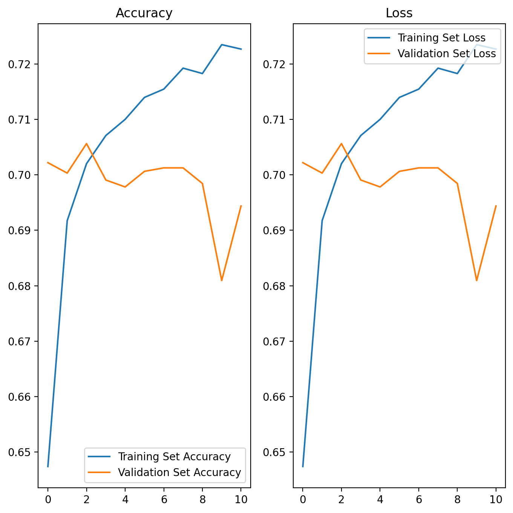

# MovieCommentSentiment

Chinese movie comment sentiment analysis system which contains a WEB and  a python back end. The WEB is based on *ktor* with a lot of cache container by myself. Some security checks are applied before handles a request. The backend is based on *tensorflow*, *gensim* and *jieba*. We try to  classify sentiment with transformer.

## How To (Use this model)

1. Requirement

> - Python 3.6+
> - Pandas
> - Tensorflow 2.X
> - Keras 2.4.X
> - Numpy
> - jieba
> - gensim 4.X

2. Download `predict.zip` from Release

3. Run predict.py

## How To (Train this model)

1. Download Douban Movie Short Comments Dataset `DMSC.csv`

https://www.kaggle.com/utmhikari/doubanmovieshortcomments

2. Download pre-trained Word Vector `sgns.zhihu.bigram`

https://github.com/Embedding/Chinese-Word-Vectors

3. Download Stop Words `cn_stopwords.txt`

https://github.com/goto456/stopwords 

4. Refer to `train\training.ipynb`

## How To (Deploy the web)

1. Complete all steps of *How To (Train this model)*
2. Download `ktor.zip` from Release and unzip
3. Edit `config.json` to configure the path of `python` and `predict.py`
4. Run `start.sh`/`start.cmd`（You need Java 8 or above）
5. Open `http://localhost:8081`

## How To (Compile the web)

1. Requirement

> - JDK 8+
> - Maven

2. Clone this project
3. `mvn clean build`

## More about the web 

`PredictService.kt`: About a python pool implemented by myself and a python wrapper.

`DoubanService.kt`: About movie data cache and a simple reptile to fetch movie comment, which based on producer consumer model.  In this way, the frequency of requesting short comments will not be too high . Note that three methods are NOT Implemented: `getDocument(int)`、`getComment(Document)` and `getTitle(Document)`.  If you want to use the movie comment capture function, you must implement these three methods yourself.

`SecurityService.kt`: About security check for request, mainly for frequency limit. It includes a  Visitor - Last access time - Count of access data structure that designed by myself.

`SentenceCacheFIFO.kt`:  A cache queue based on clock algorithm and second chance strategy.

`WebMain.kt`:  The handler that correctly routes the request to the above components and do something before and after web server runs.

## More about the Transformer

**Procedure**

1. Preprocessing dataset,

2. Use *jieba* to do  text segmentation.

3. Use *gensim* to load pre-trained Chinese word vector.

4. Use *keras* to construct this model.

**Performence**

TrainingSet : ValidationSet: TestSet = 7.2：0.8 ：2

Only consider the first 30K words and randomly choose 40K comments,

Test Set Accuracy: 0.7

**Reference**

https://keras.io/examples/nlp/text_classification_with_transformer/

https://github.com/aespresso/chinese_sentiment

## Licence

### 1. Web

MIT License

**Copyright (c) 2021 ColorsWind**

Permission is hereby granted, free of charge, to any person obtaining a copy of this software and associated documentation files (the "Software"), to deal in the Software without restriction, including without limitation the rights to use, copy, modify, merge, publish, distribute, sublicense, and/or sell copies of the Software, and to permit persons to whom the Software is furnished to do so, subject to the following conditions:

The above copyright notice and this permission notice shall be included in all copies or substantial portions of the Software.

THE SOFTWARE IS PROVIDED "AS IS", WITHOUT WARRANTY OF ANY KIND, EXPRESS OR IMPLIED, INCLUDING BUT NOT LIMITED TO THE WARRANTIES OF MERCHANTABILITY, FITNESS FOR A PARTICULAR PURPOSE AND NONINFRINGEMENT. IN NO EVENT SHALL THE AUTHORS OR COPYRIGHT HOLDERS BE LIABLE FOR ANY CLAIM, DAMAGES OR OTHER LIABILITY, WHETHER IN AN ACTION OF CONTRACT, TORT OR OTHERWISE, ARISING FROM, OUT OF OR IN CONNECTION WITH THE SOFTWARE OR THE USE OR OTHER DEALINGS IN THE SOFTWARE.

### 2. HTML&CSS

https://github.com/jgthms/bulma/

The MIT License (MIT)

**Copyright (c) 2021 Jeremy Thomas**

Permission is hereby granted, free of charge, to any person obtaining a copy
of this software and associated documentation files (the "Software"), to deal
in the Software without restriction, including without limitation the rights
to use, copy, modify, merge, publish, distribute, sublicense, and/or sell
copies of the Software, and to permit persons to whom the Software is
furnished to do so, subject to the following conditions:

The above copyright notice and this permission notice shall be included in
all copies or substantial portions of the Software.

THE SOFTWARE IS PROVIDED "AS IS", WITHOUT WARRANTY OF ANY KIND, EXPRESS OR
IMPLIED, INCLUDING BUT NOT LIMITED TO THE WARRANTIES OF MERCHANTABILITY,
FITNESS FOR A PARTICULAR PURPOSE AND NONINFRINGEMENT. IN NO EVENT SHALL THE
AUTHORS OR COPYRIGHT HOLDERS BE LIABLE FOR ANY CLAIM, DAMAGES OR OTHER
LIABILITY, WHETHER IN AN ACTION OF CONTRACT, TORT OR OTHERWISE, ARISING FROM,
OUT OF OR IN CONNECTION WITH THE SOFTWARE OR THE USE OR OTHER DEALINGS IN
THE SOFTWARE.

### 3. Prediction Model

https://keras.io/examples/nlp/text_classification_with_transformer/

https://github.com/aespresso/chinese_sentiment

